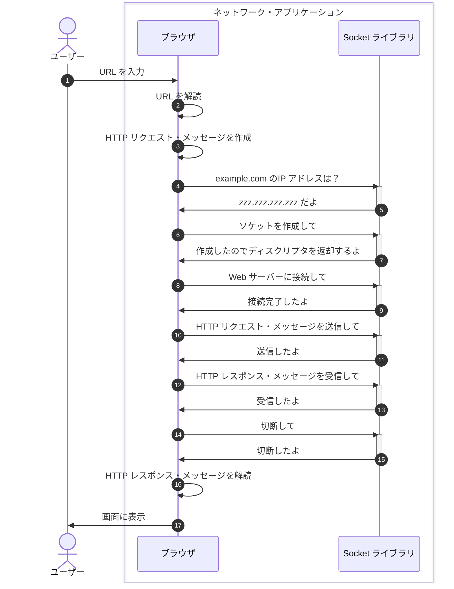

## はじめに

### ネットワーク知識の重要性

ネットワークは、**バックエンドエンジニアにとって重要な知識**です。
もちろんインフラエンジニアほど詳しくなくても問題ありませんが、基本的な知識は身につけておかないと業務に支障が出ます。

事実、有名なバックエンドエンジニアのロードマップでもネットワークの知識が必須とされています。

https://roadmap.sh/backend

また、私自身業務経験を思い返してみても、ネットワークの知識がないと困ることが多々ありました。

### ネットワーク知識を記憶することの困難性

一方で、ネットワーク知識を正確に覚えておくことは非常に難しいです。

その理由は主に 2 つあると思っています。

- 普段そこまで意識しないから
- 幅広く奥深いテーマだから

普段プログラムを書いているとき、常にネットワークのことを意識している人は少ないと思います。
リンクをクリックするたびに DNS サーバーのことを毎回考えないわけです。
そんな業務時間を長く過ごすうちに「DNS サーバーの動作ってどんなんだっけ？」となるわけです。

また、いうまでもなくネットワークの知識は非常に幅広く奥深いです。
ほぼ一生をかけて HTTP プロトコルについて研究することもできるでしょう。

### 困難性とどう向き合うか

この困ったネットワークとどう向き合うか、私は以下のように考えています。

- 図解する
- 仕様など詳細なことはすぐ辿れるようにしておく

経験上、一度図解しておくと復習が非常に楽です。
文章で書くよりも、図解の方が見返す時間が圧倒的に短くて済みます。

また、仕様などの細かい情報は頑張って文章にしようとするのではなく、きちんとしたリンクを貼っておくことが重要です。
文章が最低限になるので、今後見返すのが楽になります。

このような考えが背景にあり、本記事を書きました。

### 本シリーズの記事一覧

- バックエンドエンジニアのためのネットワーク基礎【ブラウザ編】　 ← 本記事

### 本記事で書かないこと

- ブラウザと Socket ライブラリ以外の動作
  - 例）DNS サーバーの動作、OS の動作　など
- プロトコルなどの詳しい仕様

## 全体像

URL を入力してから Web ページを表示するまでをシーケンス図で示したのが以下です。

注意点は、**Socket ライブラリがさらに OS に依頼する**という点です。
つまり、実際には Socket ライブラリのアクティビティからさらに OS に矢印を伸ばす必要があります。

ただ、それをしだすと図解が細かくなりすぎるので本記事では避けました。

## Seq.1 URL を入力

ユーザーがブラウザに URL[^1] を入力します。

[^1]: [URL Standard](https://url.spec.whatwg.org/)

「URL を入力」といっても、アドレスバーに直接入力するだけではなく、リンクをクリックしたり、フォームを送信したり、など様々な方法があります。

## Seq.2 URL を解読

ブラウザは URL を解読します。

具体的には、**URL を構成する各要素を分解して、それぞれの意味を解釈**します。
たとえば「ホスト名は example.com で〜」というふうに解釈していきます。

## Seq.3 HTTP リクエスト・メッセージを作成

ブラウザは URL などの情報をもとに HTTP[^2] リクエスト・メッセージを作成します。

[^2]: [HTTP | MDN](https://developer.mozilla.org/ja/docs/Web/HTTP)

## Seq.4〜5 Web サーバーの IP アドレスを取得

ブラウザは Web サーバーの IP アドレスを取得します。

**OS に送信依頼を出すときは、ドメイン名ではなく IP アドレス[^3]を指定する必要がある**からです。

[^3]: [IP Address (IP アドレス) - MDN Web Docs 用語集: ウェブ関連用語の定義 | MDN](https://developer.mozilla.org/ja/docs/Glossary/IP_Address)

Web サーバーの IP アドレスを取得するため DNS サーバーに問い合わせるのですが、その機能は Socket ライブラリ[^4]によって提供されます。

[^4]: Socket ライブラリとは、ネットワークの機能を呼び出すためのプログラム部品集のこと

`gethostbyname()`というプログラムがそれです。
`gethostbyname("example.com")`という命令をブラウザアプリケーションが実行すると、example.com の IP アドレスを取得することができます。

具体的に、`gethostbyname()`は以下のような処理をします。

1. DNS サーバーに送る問い合わせメッセージを作成
2. そのメッセージを DNS サーバーに送信
3. DNS サーバーからの応答メッセージを受信
4. 応答メッセージから IP アドレスを取り出す
5. IP アドレスをブラウザなどのネットワーク・アプリケーションに返却

:::message
DNS サーバー側の動作については**別記事で解説**します。
ここでは、うまいこと DNS サーバーに問い合わせて IP アドレスを取得できたという前提で話を進めます。
:::

## Seq.6〜15 HTTP メッセージを送受信

Seq.4〜5 と同様、HTTP メッセージを送受信するための機能は Socket ライブラリによって提供されます。
具体的には、Socket ライブラリを使って以下を実行するよう OS に依頼します。

1. ソケットを作る
2. サーバー側のソケットにパイプをつなぐ
3. データを送受信する
4. パイプを外してソケットを抹消する

:::message
OS 側の動作については**別記事で解説**します。
ここでは、うまいこと OS が HTTP メッセージを送受信してくれる前提で話を進めます。
:::

### Seq.6〜7 ソケットを作る

ブラウザは Socket ライブラリの`socket()`というプログラムを呼び出します。

ソケットが作れたら、Socket ライブラリはディスクリプタ[^5]を返却します。

[^5]: ディスクリプタとは、ソケットを識別するための情報のこと

### Seq.8〜9 サーバー側のソケットにパイプをつなぐ

ブラウザは Socket ライブラリの`connect()`というプログラムを呼び出します。

`connect()`を呼び出す際には、ディスクリプタ、IP アドレス、ポート番号[^6]を指定します。

[^6]: ポート番号とは、接続相手側からソケットを識別するための情報のこと

### Seq.10〜13 データを送受信する

ブラウザは Socket ライブラリの`write()`や`read()`というプログラムを呼び出します。

`write()`を呼び出す際には、ディスクリプタと送信データを指定します。
`read()`を呼び出す際には、ディスクリプタと受信バッファを指定します。

### Seq.14〜15 パイプを外してソケットを抹消する

ブラウザは Socket ライブラリの`close()`というプログラムを呼び出します。

`close()`を呼び出す際には、ディスクリプタを指定します。

## Seq.16 HTTP レスポンス・メッセージを解読

ブラウザは HTTP プロトコルに従って、HTTP レスポンス・メッセージを解読します。

## Seq.17 画面に表示

ブラウザは HTTP レスポンス・メッセージからデータを取り出して、画面に表示します。
これにより、ユーザーは Web サイトを閲覧することができます。

## まとめ

ブラウザは以下のような流れで Web サイトを表示します。

1. URL を解読
2. HTTP リクエスト・メッセージを作成
3. Web サーバーの IP アドレスを取得
4. ソケットを作成
5. サーバー側のソケットにパイプをつなぐ
6. HTTP メッセージを送受信
7. パイプを外してソケットを抹消
8. HTTP レスポンス・メッセージを解読
9. 画面に表示

## 参考

- [ネットワークはなぜつながるのか　第２版](https://www.amazon.co.jp/dp/B077XSB8BS)
