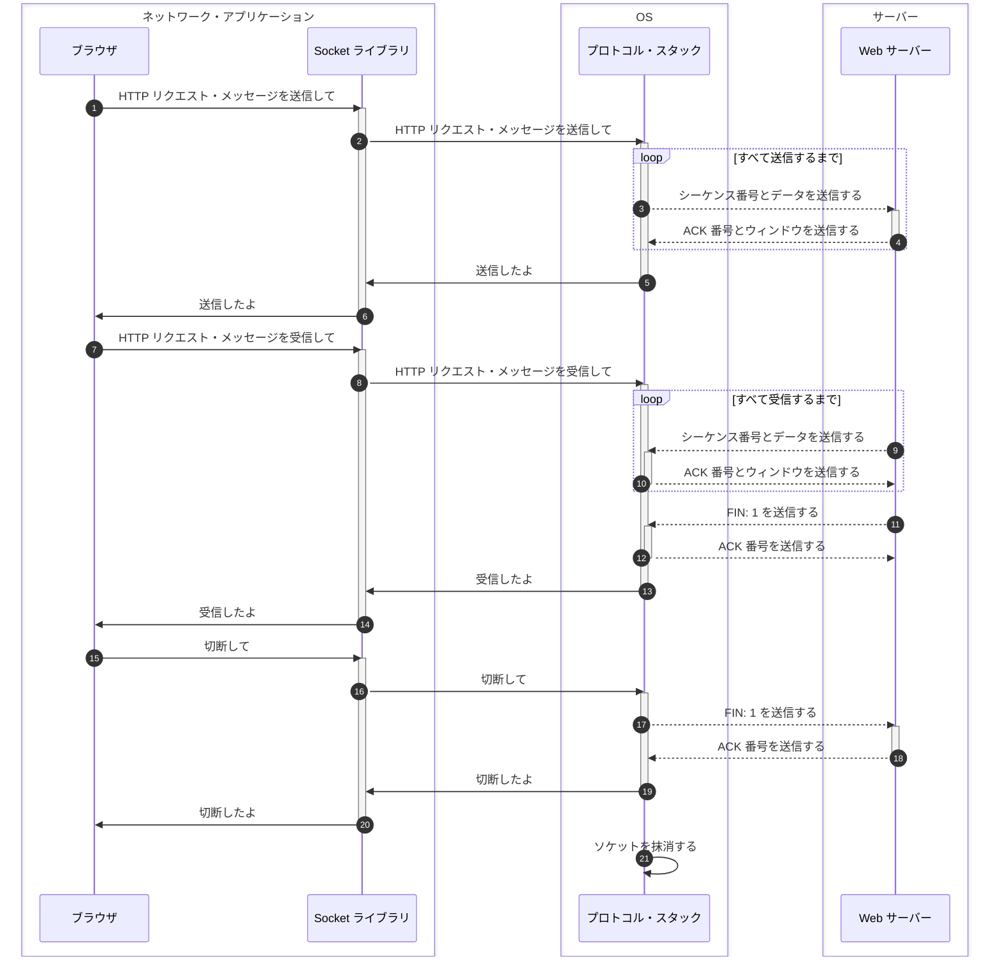

## はじめに

本シリーズの執筆意図などは本シリーズ初回の記事に書いてあります。

- [初回のブラウザ編 > ネットワーク知識の重要性](https://zenn.dev/jnkmtsd/articles/0d129a7aa0947b#%E3%83%8D%E3%83%83%E3%83%88%E3%83%AF%E3%83%BC%E3%82%AF%E7%9F%A5%E8%AD%98%E3%81%AE%E9%87%8D%E8%A6%81%E6%80%A7)
- [初回のブラウザ編 > ネットワーク知識を記憶することの困難性](https://zenn.dev/jnkmtsd/articles/0d129a7aa0947b#%E3%83%8D%E3%83%83%E3%83%88%E3%83%AF%E3%83%BC%E3%82%AF%E7%9F%A5%E8%AD%98%E3%82%92%E8%A8%98%E6%86%B6%E3%81%99%E3%82%8B%E3%81%93%E3%81%A8%E3%81%AE%E5%9B%B0%E9%9B%A3%E6%80%A7)
- [初回のブラウザ編 > 困難性とどう向き合うか](https://zenn.dev/jnkmtsd/articles/0d129a7aa0947b#%E5%9B%B0%E9%9B%A3%E6%80%A7%E3%81%A8%E3%81%A9%E3%81%86%E5%90%91%E3%81%8D%E5%90%88%E3%81%86%E3%81%8B)

### 本シリーズの記事一覧

- [バックエンドエンジニアのためのネットワーク基礎【ブラウザ編】](https://zenn.dev/jnkmtsd/articles/0d129a7aa0947b)
- [バックエンドエンジニアのためのネットワーク基礎【DNS サーバー編】](https://zenn.dev/jnkmtsd/articles/e59e42beec39e0)
- [バックエンドエンジニアのためのネットワーク基礎【プロトコル・スタック TCP 接続編】](https://zenn.dev/jnkmtsd/articles/e0ecb28f1875f2)
- バックエンドエンジニアのためのネットワーク基礎【プロトコル・スタック TCP 送受信編】　 ← 本記事
- [バックエンドエンジニアのためのネットワーク基礎【プロトコル・スタック IP 編】](https://zenn.dev/jnkmtsd/articles/61f104becc1750)
- [バックエンドエンジニアのためのネットワーク基礎【イーサネット編】](https://zenn.dev/jnkmtsd/articles/c50f9113995773)
- [バックエンドエンジニアのためのネットワーク基礎【プロトコル・スタック UDP 編】](https://zenn.dev/jnkmtsd/articles/46615811cadd72)
- [バックエンドエンジニアのためのネットワーク基礎【ハブ編】](https://zenn.dev/jnkmtsd/articles/24874950f6e4ea)
- [バックエンドエンジニアのためのネットワーク基礎【ルーター編】](https://zenn.dev/jnkmtsd/articles/e11381c0cafe3e)
- [バックエンドエンジニアのためのネットワーク基礎【アクセス回線編】](https://zenn.dev/jnkmtsd/articles/b8588f4326dc73)
- [バックエンドエンジニアのためのネットワーク基礎【プロバイダー編】](https://zenn.dev/jnkmtsd/articles/52b465bc9d8d97)
- [バックエンドエンジニアのためのネットワーク基礎【Web サーバー編】](https://zenn.dev/jnkmtsd/articles/660223f2d36a8c)

### 本記事で書かないこと

- OS 以外の動作
  - 例）LAN アダプタ、ネットワーク・アプリケーション　など
- プロトコルなどの詳しい仕様

## 全体像

[初回のブラウザ編 > 全体像](https://zenn.dev/jnkmtsd/articles/0d129a7aa0947b#%E5%85%A8%E4%BD%93%E5%83%8F)の中の、以下赤枠で示した箇所を細分化していきます。

それが以下です。

Seq.3 Seq.4 Seq.9 Seq.10 Seq.11 Seq.12 Seq.17 Seq.18 は点線で示していますが、ここには様々な処理が隠蔽されています。
たとえば、LAN アダプタがどうのこうのとかそういうのが大量に含まれています。
このあたりのことは別記事で解説します。

## Seq.1〜6 HTTP リクエスト・メッセージを送信する

### Seq.3 [OS 側] シーケンス番号とデータを送信する

シーケンス番号[^1]は接続時に決めておいた初期値をそのまま使います。
ここでは、仮に 1 とします。
また、データのサイズを 1460 バイトとします。

[^1]: [バックエンドエンジニアのためのネットワーク基礎【プロトコル・スタック TCP 接続編】 > 脚注 10](https://zenn.dev/jnkmtsd/articles/e0ecb28f1875f2#fn-849c-10)参照

### Seq.4 [Web サーバー側] ACK 番号とウィンドウを送信する

ACK[^2] 番号を計算します。
クライアントから受け取ったシーケンス番号とデータのサイズを足した値が ACK 番号になります。
つまり、ここでは 1461 となります。

アプリケーションにデータを渡して受信バッファに空きができたら、そのときはウィンドウ[^3]の値も送信します。

Seq.3 Seq.4 をリクエスト・メッセージを送り終えるまで繰り返します。

[^2]: [バックエンドエンジニアのためのネットワーク基礎【プロトコル・スタック TCP 接続編】 > 脚注 12](https://zenn.dev/jnkmtsd/articles/e0ecb28f1875f2#fn-849c-12)参照
[^3]: [バックエンドエンジニアのためのネットワーク基礎【プロトコル・スタック TCP 接続編】 > 脚注 11](https://zenn.dev/jnkmtsd/articles/e0ecb28f1875f2#fn-849c-11)参照

## Seq.7〜14 HTTP リクエスト・メッセージを受信する

### Seq.9 [Web サーバー側] シーケンス番号とデータを送信する

Seq.3 と同様です。

### Seq.10 [OS 側] ACK 番号とウィンドウを送信する

Seq.4 と同様です。

Seq.9 Seq.10 をレスポンス・メッセージを送り終えるまで繰り返します。

### Seq.11 [Web サーバー側] FIN: 1 を送信する

すべてデータを送信し終えたら、その旨を OS 側に伝えつつ切断動作に入ります。
FIN は、切断を意味します。
同時に、サーバー側のソケットに切断動作に入ったという情報を記録します。

### Seq.12 [OS 側] ACK 番号を送信する

OS 側のソケットにサーバー側が切断動作に入ったことを記録します。
そして、ACK 番号を送信します。

## Seq.15〜21 切断する

### Seq.17 [OS 側] FIN: 1 を送信する

Seq.11 と同様です。

### Seq.18 [Web サーバー側] ACK 番号を送信する

Seq.12 と同様です。

### Seq.21 [OS 側] ソケットを抹消する

通常、数分待ってからソケットを抹消します。

## まとめ

プロトコル・スタックは以下のような流れで Web サーバーとデータの送受信を行い、切断します。

1. 送信の際、プロトコル・スタックはシーケンス番号とデータを送信し、ACK 番号とウィンドウを受信する
2. 受信の際、プロトコル・スタックはシーケンス番号とデータを受信し、ACK 番号とウィンドウを送信する
3. 受信が終わったら、プロトコル・スタックは FIN: 1 を受信し、ACK 番号を送信する
4. プロトコル・スタックは FIN: 1 を送信し、ACK 番号を受信する
5. ソケットを抹消する

## 参考

- [ネットワークはなぜつながるのか　第２版](https://www.amazon.co.jp/dp/B077XSB8BS)
