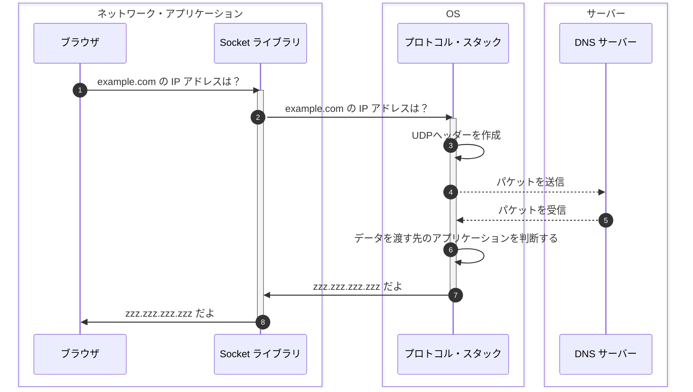

## はじめに

本シリーズの執筆意図などは本シリーズ初回の記事に書いてあります。

- [初回のブラウザ編 > ネットワーク知識の重要性](https://zenn.dev/jnkmtsd/articles/0d129a7aa0947b#%E3%83%8D%E3%83%83%E3%83%88%E3%83%AF%E3%83%BC%E3%82%AF%E7%9F%A5%E8%AD%98%E3%81%AE%E9%87%8D%E8%A6%81%E6%80%A7)
- [初回のブラウザ編 > ネットワーク知識を記憶することの困難性](https://zenn.dev/jnkmtsd/articles/0d129a7aa0947b#%E3%83%8D%E3%83%83%E3%83%88%E3%83%AF%E3%83%BC%E3%82%AF%E7%9F%A5%E8%AD%98%E3%82%92%E8%A8%98%E6%86%B6%E3%81%99%E3%82%8B%E3%81%93%E3%81%A8%E3%81%AE%E5%9B%B0%E9%9B%A3%E6%80%A7)
- [初回のブラウザ編 > 困難性とどう向き合うか](https://zenn.dev/jnkmtsd/articles/0d129a7aa0947b#%E5%9B%B0%E9%9B%A3%E6%80%A7%E3%81%A8%E3%81%A9%E3%81%86%E5%90%91%E3%81%8D%E5%90%88%E3%81%86%E3%81%8B)

### 本シリーズの記事一覧

- [バックエンドエンジニアのためのネットワーク基礎【ブラウザ編】](https://zenn.dev/jnkmtsd/articles/0d129a7aa0947b)
- [バックエンドエンジニアのためのネットワーク基礎【DNS サーバー編】](https://zenn.dev/jnkmtsd/articles/e59e42beec39e0)
- [バックエンドエンジニアのためのネットワーク基礎【プロトコル・スタック TCP 接続編】](https://zenn.dev/jnkmtsd/articles/e0ecb28f1875f2)
- [バックエンドエンジニアのためのネットワーク基礎【プロトコル・スタック TCP 送受信編】](https://zenn.dev/jnkmtsd/articles/37a25508b30635)
- [バックエンドエンジニアのためのネットワーク基礎【プロトコル・スタック IP 編】](https://zenn.dev/jnkmtsd/articles/61f104becc1750)
- [バックエンドエンジニアのためのネットワーク基礎【イーサネット編】](https://zenn.dev/jnkmtsd/articles/c50f9113995773)
- バックエンドエンジニアのためのネットワーク基礎【プロトコル・スタック UDP 編】　 ← 本記事
- [バックエンドエンジニアのためのネットワーク基礎【ハブ編】](https://zenn.dev/jnkmtsd/articles/24874950f6e4ea)
- [バックエンドエンジニアのためのネットワーク基礎【ルーター編】](https://zenn.dev/jnkmtsd/articles/e11381c0cafe3e)
- [バックエンドエンジニアのためのネットワーク基礎【アクセス回線編】](https://zenn.dev/jnkmtsd/articles/b8588f4326dc73)
- [バックエンドエンジニアのためのネットワーク基礎【プロバイダー編】](https://zenn.dev/jnkmtsd/articles/52b465bc9d8d97)

### 本記事で書かないこと

- OS 以外の動作
  - 例）LAN アダプタ、ネットワーク・アプリケーション　など
- プロトコルなどの詳しい仕様

## 全体像

[初回のブラウザ編 > 全体像](https://zenn.dev/jnkmtsd/articles/0d129a7aa0947b#%E5%85%A8%E4%BD%93%E5%83%8F)の中の、以下赤枠で示した箇所を細分化していきます。

それが以下です。

Seq.4 Seq.5 は点線で示していますが、ここには様々な処理が隠蔽されています。
たとえば、LAN アダプタがどうのこうのとかそういうのが大量に含まれています。
このあたりのことは別記事ですでに書いているので、そちらを参照してください。

今回は UDP について書いていきます。
1 つのパケットで済んでしまう場合は、TCP を使う必要はありません。
受信確認やウィンドウという概念が不要なのでシンプルです。

## Seq.1〜4 送信する

Seq.1 Seq.2 は全体像の通りなので解説は割愛します。

### Seq.3 UDP ヘッダーを作成する

制御情報は次のとおりです。

- 送信元ポート番号
- 送信先ポート番号
- データ長[^1]
- チェックサム[^2]

[^1]: UDP ヘッダー以後の長さ
[^2]: 誤りの有無を検査するための情報

### Seq.4 パケットを送信する

IP に依頼して送信します。

## Seq.5〜8 受信する

Seq.7 Seq.8 は全体像の通りなので解説は割愛します。

### Seq.5 パケットを受信する

Seq.4 と同様です。

### Seq.6 データを渡す先のアプリケーションを判断する

以下情報を使ってデータを渡す先のアプリケーションを判断します。

- IP ヘッダーに記載されている宛先 IP アドレスと送信元 IP アドレス
- UDP ヘッダーに記載されている宛先ポート番号と送信元ポート番号
- ソケットに記録された情報

エラーはアプリケーションが気づきます。

## まとめ

プロトコル・スタックは以下のような流れで UDP プロトコルで通信します。

1. プロトコル・スタックは UDP ヘッダーを作成してパケットを送信する
2. プロトコル・スタックはパケットを受信したら UDP ヘッダーなどを確認してデータを渡す先のアプリケーションを判断する
3. プロトコル・スタックはアプリケーションにデータを渡す

## 参考

- [ネットワークはなぜつながるのか　第２版](https://www.amazon.co.jp/dp/B077XSB8BS)
