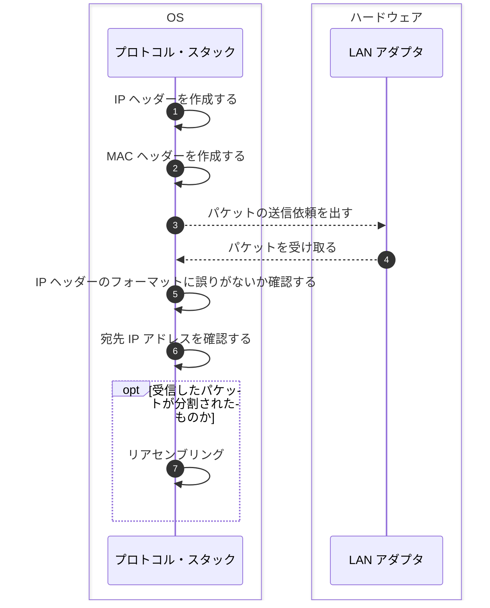

## はじめに

本シリーズの執筆意図などは本シリーズ初回の記事に書いてあります。

- [初回のブラウザ編 > ネットワーク知識の重要性](https://zenn.dev/jnkmtsd/articles/0d129a7aa0947b#%E3%83%8D%E3%83%83%E3%83%88%E3%83%AF%E3%83%BC%E3%82%AF%E7%9F%A5%E8%AD%98%E3%81%AE%E9%87%8D%E8%A6%81%E6%80%A7)
- [初回のブラウザ編 > ネットワーク知識を記憶することの困難性](https://zenn.dev/jnkmtsd/articles/0d129a7aa0947b#%E3%83%8D%E3%83%83%E3%83%88%E3%83%AF%E3%83%BC%E3%82%AF%E7%9F%A5%E8%AD%98%E3%82%92%E8%A8%98%E6%86%B6%E3%81%99%E3%82%8B%E3%81%93%E3%81%A8%E3%81%AE%E5%9B%B0%E9%9B%A3%E6%80%A7)
- [初回のブラウザ編 > 困難性とどう向き合うか](https://zenn.dev/jnkmtsd/articles/0d129a7aa0947b#%E5%9B%B0%E9%9B%A3%E6%80%A7%E3%81%A8%E3%81%A9%E3%81%86%E5%90%91%E3%81%8D%E5%90%88%E3%81%86%E3%81%8B)

### 本シリーズの記事一覧

- [バックエンドエンジニアのためのネットワーク基礎【ブラウザ編】](https://zenn.dev/jnkmtsd/articles/0d129a7aa0947b)
- [バックエンドエンジニアのためのネットワーク基礎【DNS サーバー編】](https://zenn.dev/jnkmtsd/articles/e59e42beec39e0)
- [バックエンドエンジニアのためのネットワーク基礎【プロトコル・スタック TCP 接続編】](https://zenn.dev/jnkmtsd/articles/e0ecb28f1875f2)
- [バックエンドエンジニアのためのネットワーク基礎【プロトコル・スタック TCP 送受信編】](https://zenn.dev/jnkmtsd/articles/37a25508b30635)
- バックエンドエンジニアのためのネットワーク基礎【プロトコル・スタック IP 編】　 ← 本記事
- [バックエンドエンジニアのためのネットワーク基礎【イーサネット編】](https://zenn.dev/jnkmtsd/articles/c50f9113995773)
- [バックエンドエンジニアのためのネットワーク基礎【プロトコル・スタック UDP 編】](https://zenn.dev/jnkmtsd/articles/46615811cadd72)
- [バックエンドエンジニアのためのネットワーク基礎【ハブ編】](https://zenn.dev/jnkmtsd/articles/24874950f6e4ea)
- [バックエンドエンジニアのためのネットワーク基礎【ルーター編】](https://zenn.dev/jnkmtsd/articles/e11381c0cafe3e)
- [バックエンドエンジニアのためのネットワーク基礎【アクセス回線編】](https://zenn.dev/jnkmtsd/articles/b8588f4326dc73)
- [バックエンドエンジニアのためのネットワーク基礎【プロバイダー編】](https://zenn.dev/jnkmtsd/articles/52b465bc9d8d97)
- [バックエンドエンジニアのためのネットワーク基礎【Web サーバー編】](https://zenn.dev/jnkmtsd/articles/660223f2d36a8c)

### 本記事で書かないこと

- OS 以外の動作
  - 例）LAN アダプタ、ネットワーク・アプリケーション　など
- プロトコルなどの詳しい仕様

## 全体像

[前々回のプロトコル・スタック TCP 接続編 > 全体像](https://zenn.dev/jnkmtsd/articles/e0ecb28f1875f2#%E5%85%A8%E4%BD%93%E5%83%8F)の中の、以下赤枠で示した箇所を細分化していきます。


それが以下です。



TCP と違って IP に接続・送信・受信・切断というフェーズの概念はありません。
単に、IP ヘッダーと MAC ヘッダーを作って、LAN アダプタにパケットを送り出すだけです。
そのため、今回は比較的図がシンプルになっています。

Seq.3 は点線で示していますが、このあたりはイーサネットのことなので、別記事で解説します。

## Seq.1〜3 パケットの送信依頼を出す

### Seq.1 IP ヘッダーを作成する

一部ですが、以下のような情報を IP ヘッダーにセットします。

| 項目               | 説明                                                                        |
| ------------------ | --------------------------------------------------------------------------- |
| 宛先 IP アドレス   | TCP 担当から通知される                                                      |
| 送信元 IP アドレス | LAN アダプタに割り当てられている                                            |
| プロトコル番号     | パケットに入れた内容物がどこから依頼されたものかを示す値（例: TCP なら 06） |

LAN アダプタというのが曲者です。
複数ありうるからです。

複数ある中から、どの LAN アダプタを使うかは、 **経路表（ルーティングテーブル）** を使って決めます。

Mac OS の場合は以下のコマンドで確認できます。

```shell
netstat -rn
```

経路表には以下のような情報が記載されています。

- 宛先 IP アドレス（Destination）
- 次のルーターの IP アドレス（Gateway）
- LAN アダプタなどのネットワーク用インタフェース（Netif）

宛先 IP アドレスを元に対象の行を特定して、その行のネットワーク用インタフェース情報を使って LAN アダプタを決定します。

送信元 IP アドレスは LAN アダプタに割り当てられているので、LAN アダプタがわかれば特定できます。

### Seq.2 MAC ヘッダーを作成する

イーサネット用ヘッダーです。
イーサネットの詳細については別記事で解説します。

| 項目                | 説明                                           |
| ------------------- | ---------------------------------------------- |
| 宛先 MAC アドレス   | ARP で調べる                                   |
| 送信元 MAC アドレス | LAN アダプタに割り当てられている               |
| イーサタイプ        | 使用するプロトコルを示す値（例: IP なら 0800） |

宛先 MAC アドレスについては、まず**経路表のときに特定した行の Gateway に書いてある IP アドレスを使います**。
この IP アドレスを使って、ARP[^1] で次のルーターの MAC アドレスを調べます。
実際には、ARP キャッシュというものがあるので、毎回 ARP で調べるわけではありません。

[^1]: ARP は、イーサネットの仕組みであるブロードキャストを使って IP アドレスから MAC アドレスを調べるプロトコルです

自分の LAN アダプタの MAC アドレスは OS 起動時にメモリーに書き込んであるので、それを使います。

## Seq.4〜7 パケットを受け取る

### Seq.5 IP ヘッダーのフォーマットに誤りがないか確認する

問題がなければ次のステップに行きます。

### Seq.6 宛先 IP アドレスを確認する

受信した LAN アダプタに割り当てたアドレスと一致するはず。
違う場合はエラーなので、ICMP というメッセージを使って、通信相手にエラーを通知します。

### Seq.7 リアセンブリング

IP は、パケットを分割して送ることができます。
これを **フラグメンテーション** といいます。

フラグメンテーションされたパケットを受け取った場合は、それらを結合して元のパケットに戻します。
このことを **リアセンブリング** といいます。

具体的には、以下のような IP ヘッダーの情報を使ってリアセンブリングします。

| 項目                     | 説明                                                         |
| ------------------------ | ------------------------------------------------------------ |
| フラグ                   | 分割されたパケットなのかどうかがわかる                       |
| ID 情報                  | 分割されたパケットはこの情報の値が皆同じ値                   |
| フラグメント・オフセット | そのパケットが元のパケットのどの位置にあったものかを表す情報 |

## まとめ

プロトコル・スタックは以下のような流れで IP プロトコルに則ってヘッダーを作成します。

1. 経路表や ARP などを使って IP ヘッダーや MAC ヘッダーを作成して、パケット送信依頼を出す
2. パケットを受け取ったら、そのパケットが誤っていないか確認したりリアセンブリングしたりする

## 参考

- [ネットワークはなぜつながるのか　第２版](https://www.amazon.co.jp/dp/B077XSB8BS)
