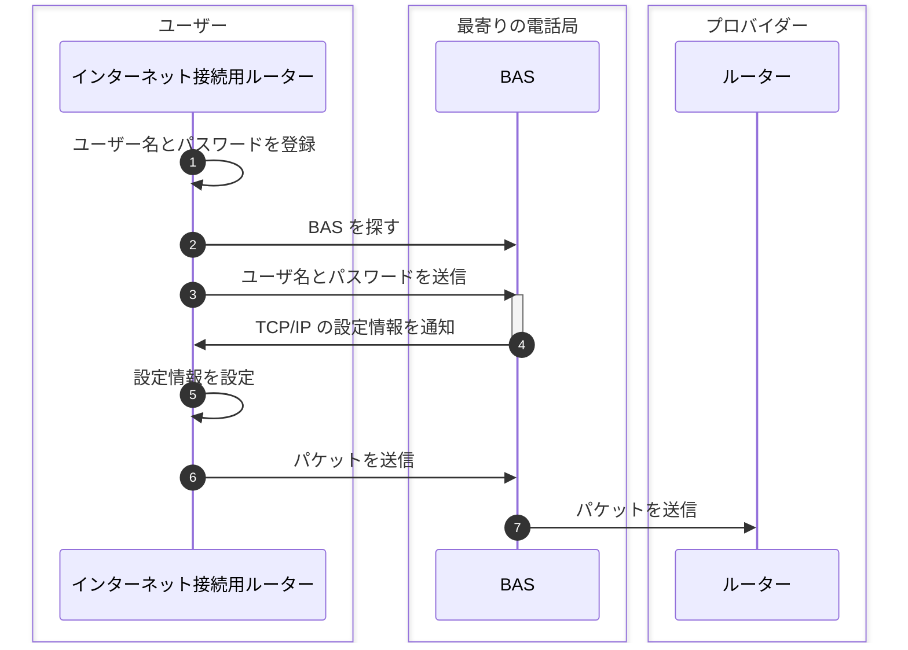

## はじめに

本シリーズの執筆意図などは本シリーズ初回の記事に書いてあります。

- [初回のブラウザ編 > ネットワーク知識の重要性](https://zenn.dev/jnkmtsd/articles/0d129a7aa0947b#%E3%83%8D%E3%83%83%E3%83%88%E3%83%AF%E3%83%BC%E3%82%AF%E7%9F%A5%E8%AD%98%E3%81%AE%E9%87%8D%E8%A6%81%E6%80%A7)
- [初回のブラウザ編 > ネットワーク知識を記憶することの困難性](https://zenn.dev/jnkmtsd/articles/0d129a7aa0947b#%E3%83%8D%E3%83%83%E3%83%88%E3%83%AF%E3%83%BC%E3%82%AF%E7%9F%A5%E8%AD%98%E3%82%92%E8%A8%98%E6%86%B6%E3%81%99%E3%82%8B%E3%81%93%E3%81%A8%E3%81%AE%E5%9B%B0%E9%9B%A3%E6%80%A7)
- [初回のブラウザ編 > 困難性とどう向き合うか](https://zenn.dev/jnkmtsd/articles/0d129a7aa0947b#%E5%9B%B0%E9%9B%A3%E6%80%A7%E3%81%A8%E3%81%A9%E3%81%86%E5%90%91%E3%81%8D%E5%90%88%E3%81%86%E3%81%8B)

### 本シリーズの記事一覧

- [バックエンドエンジニアのためのネットワーク基礎【ブラウザ編】](https://zenn.dev/jnkmtsd/articles/0d129a7aa0947b)
- [バックエンドエンジニアのためのネットワーク基礎【DNS サーバー編】](https://zenn.dev/jnkmtsd/articles/e59e42beec39e0)
- [バックエンドエンジニアのためのネットワーク基礎【プロトコル・スタック TCP 接続編】](https://zenn.dev/jnkmtsd/articles/e0ecb28f1875f2)
- [バックエンドエンジニアのためのネットワーク基礎【プロトコル・スタック TCP 送受信編】](https://zenn.dev/jnkmtsd/articles/37a25508b30635)
- [バックエンドエンジニアのためのネットワーク基礎【プロトコル・スタック IP 編】](https://zenn.dev/jnkmtsd/articles/61f104becc1750)
- [バックエンドエンジニアのためのネットワーク基礎【イーサネット編】](https://zenn.dev/jnkmtsd/articles/c50f9113995773)
- [バックエンドエンジニアのためのネットワーク基礎【プロトコル・スタック UDP 編】](https://zenn.dev/jnkmtsd/articles/46615811cadd72)
- [バックエンドエンジニアのためのネットワーク基礎【ハブ編】](https://zenn.dev/jnkmtsd/articles/24874950f6e4ea)
- [バックエンドエンジニアのためのネットワーク基礎【ルーター編】](https://zenn.dev/jnkmtsd/articles/e11381c0cafe3e)
- バックエンドエンジニアのためのネットワーク基礎【アクセス回線編】　 ← 本記事
- [バックエンドエンジニアのためのネットワーク基礎【プロバイダー編】](https://zenn.dev/jnkmtsd/articles/52b465bc9d8d97)

### 本記事で書かないこと

- アクセス回線以外の動作
  - 例）LAN アダプタ、ネットワーク・アプリケーション　など
- プロトコルなどの詳しい仕様

## 全体像

[イーサネット編 > 全体像](https://zenn.dev/jnkmtsd/articles/c50f9113995773#%E5%85%A8%E4%BD%93%E5%83%8F)の中の、以下赤枠で示した箇所を細分化していきます。

それが以下です。

今回は数あるアクセス回線の中でも、代表的な FTTH について説明します。

## Seq.1 ユーザー名とパスワードを登録

プロバイダーから割り当てられたユーザー名とパスワードを登録します。

## Seq.2 BAS を探す

PPPoE の Discovery という仕組みに従って BAS を探します。

## Seq.3 ユーザ名とパスワードを送信

追加で解説することはないので割愛します。

## Seq.4 TCP/IP の設定情報を通知

具体的には、以下の情報を通知します。

- インターネットに接続する機器に割り当てる IP アドレス
- DNS サーバーの IP アドレス
- デフォルトゲートウェイの IP アドレス

## Seq.5 設定情報を設定

Seq.4 で通知された設定情報を設定します。

## Seq.6 [ルーター側] パケットを送信

イーサネットではなく、PPPoE のルールに従ってパケットを送信します。

以下のようなヘッダーを付けて送信します。

- MAC ヘッダーの宛先 MAC アドレス: PPPoE の Discovery で調べた BAS の MAC アドレス
- 送信元 MAC アドレス: インターネット接続用ルーターの BAS 側のポートの MAC アドレス
- イーサ・タイプ: PPPoE を表す 8863（16 進数）という値

## Seq.7 [BAS 側] パケットを送信

以下のような流れでパケットを送信します。

1. 届いたパケットから MAC ヘッダーと PPPoE ヘッダーを取り去る
2. PPP ヘッダー以後の部分を取り出す
3. トンネリングの仕組みを使ってパケットを送信
4. PPP のパケットがプロバイダのルーターに届く

## まとめ

インターネット接続用ルーターとプロバイダのルーターの間で、PPPoE というプロトコルを使って通信を行います。

1. [ルーター側] ユーザー名とパスワードを登録
2. [ルーター側] BAS を探す
3. [ルーター側] ユーザ名とパスワードを送信
4. [BAS 側]TCP/IP の設定情報を通知
5. [ルーター側] 設定情報を設定
6. [ルーター側] パケットを送信
7. [BAS 側] パケットを送信

## 参考

- [ネットワークはなぜつながるのか　第２版](https://www.amazon.co.jp/dp/B077XSB8BS)
