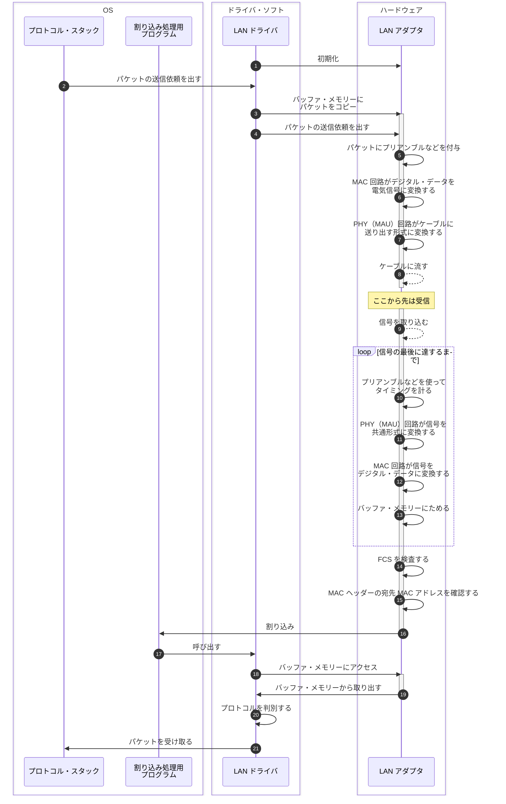

## はじめに

本シリーズの執筆意図などは本シリーズ初回の記事に書いてあります。

- [初回のブラウザ編 > ネットワーク知識の重要性](https://zenn.dev/jnkmtsd/articles/0d129a7aa0947b#%E3%83%8D%E3%83%83%E3%83%88%E3%83%AF%E3%83%BC%E3%82%AF%E7%9F%A5%E8%AD%98%E3%81%AE%E9%87%8D%E8%A6%81%E6%80%A7)
- [初回のブラウザ編 > ネットワーク知識を記憶することの困難性](https://zenn.dev/jnkmtsd/articles/0d129a7aa0947b#%E3%83%8D%E3%83%83%E3%83%88%E3%83%AF%E3%83%BC%E3%82%AF%E7%9F%A5%E8%AD%98%E3%82%92%E8%A8%98%E6%86%B6%E3%81%99%E3%82%8B%E3%81%93%E3%81%A8%E3%81%AE%E5%9B%B0%E9%9B%A3%E6%80%A7)
- [初回のブラウザ編 > 困難性とどう向き合うか](https://zenn.dev/jnkmtsd/articles/0d129a7aa0947b#%E5%9B%B0%E9%9B%A3%E6%80%A7%E3%81%A8%E3%81%A9%E3%81%86%E5%90%91%E3%81%8D%E5%90%88%E3%81%86%E3%81%8B)

### 本シリーズの記事一覧

- [バックエンドエンジニアのためのネットワーク基礎【ブラウザ編】](https://zenn.dev/jnkmtsd/articles/0d129a7aa0947b)
- [バックエンドエンジニアのためのネットワーク基礎【DNS サーバー編】](https://zenn.dev/jnkmtsd/articles/e59e42beec39e0)
- [バックエンドエンジニアのためのネットワーク基礎【プロトコル・スタック TCP 接続編】](https://zenn.dev/jnkmtsd/articles/e0ecb28f1875f2)
- [バックエンドエンジニアのためのネットワーク基礎【プロトコル・スタック TCP 送受信編】](https://zenn.dev/jnkmtsd/articles/37a25508b30635)
- [バックエンドエンジニアのためのネットワーク基礎【プロトコル・スタック IP 編】](https://zenn.dev/jnkmtsd/articles/61f104becc1750)
- バックエンドエンジニアのためのネットワーク基礎【イーサネット編】　 ← 本記事
- [バックエンドエンジニアのためのネットワーク基礎【プロトコル・スタック UDP 編】](https://zenn.dev/jnkmtsd/articles/46615811cadd72)
- [バックエンドエンジニアのためのネットワーク基礎【ハブ編】](https://zenn.dev/jnkmtsd/articles/24874950f6e4ea)

### 本記事で書かないこと

- イーサネット以外の動作
  - 例）Web サーバー、ネットワーク・アプリケーション　など
- プロトコルなどの詳しい仕様

## 全体像

[前回のプロトコル・スタック IP 編 > 全体像](https://zenn.dev/jnkmtsd/articles/61f104becc1750#%E5%85%A8%E4%BD%93%E5%83%8F)の中の、以下赤枠で示した箇所を細分化していきます。

それが以下です。

今回も IP と同様、接続・送信・受信・切断というフェーズの概念はありません。

Seq.8 Seq.9 は点線で示していますが、このあたりは LAN ケーブルが関わることなので簡略化したという意図があります。

## Seq.1 LAN アダプタを初期化する

OS を起動したときに LAN ドライバが LAN アダプタを初期化します。

イーサネット特有の作業としては、MAC という回路に MAC アドレスをセットすることです。
MAC アドレスは LAN アダプタの ROM に書き込まれています。

## Seq.2〜8 パケットを送り出す

Seq.2〜4 Seq.8 は全体像の通りなので解説は割愛します。

### Seq.5 パケットにプリアンブルなどを付与

パケットに以下情報を付与します。

| 項目                                  | 説明                                                         |
| ------------------------------------- | ------------------------------------------------------------ |
| プリアンブル                          | 送信するパケットを読み取るときのタイミングをとるためのデータ |
| スタート・フレーム・デリミタ          | パケットの開始位置を示すデータ                               |
| FCS（フレーム・チェック・シーケンス） | データが化けてしまったことを検出するためのデータ             |

### Seq.6 MAC 回路がデジタル・データを電気信号に変換する

プリアンブルの頭から順番に 1 ビットずつ電気信号に変換します。

### Seq.7 PHY（MAU）回路がケーブルに送り出す形式に変換する

イーサネットはケーブルの種類や伝送速度によって信号の形式がいくつか規定されています。
MAC 回路はその違いを意識せずに、共通形式の信号を作成します。
PHY（MAU）回路はその信号を、実際にケーブルに送り出す形式に変換します。

## Seq.9〜21 パケットを受け取る

Seq.9 Seq.21 は全体像の通りなので解説は割愛します。

### Seq.10〜13 信号の最後まで取り込む

流れは受信のときと逆です。

### Seq.14 FCS を検査する

パケットの先頭から計算式に当てはめて FCS の値を計算します。
それとパケット末尾の FCS の値と比較します。
食い違いがある場合は、エラー・パケットと見なして棄てます。

### Seq.15 MAC ヘッダーの宛先 MAC アドレスを確認する

LAN アダプタを初期化するときにセットした自分の MAC アドレスと一致するか確認します。

### Seq.16〜17 割り込み

LAN アダプタ側からコンピュータに通知します。
コンピュータも LAN ドライバもパケットの到着に気づかないからです。

全体像だと、割り込み処理用プログラムに直接矢印がひかれています。
しかし、実際には CPU に割り込みが通知されます。
CPU が割り込み処理用プログラムの方に切り替えます。
そこから LAN ドライバが呼び出されます。

### Seq.18〜21 パケットを取り出してプロトコル・スタックに渡す

LAN ドライバは LAN アダプタのバッファ・メモリーからパケットを取り出します。
次に、プロトコルを判別します。
今回は TCP/IP なので、TCP/IP のプロトコル・スタックにパケットを渡します。

## まとめ

LAN ドライバは LAN アダプタをコントロールしつつ、パケットの送受信を以下のような流れで行います。

1. LAN ドライバが LAN アダプタにパケット送信依頼を出す
2. LAN アダプタがプリアンブル、スタート・フレーム・デリミタ、FCS を付与して電気信号に変換して、ケーブルに流す
3. LAN アダプタは送信したときと逆の流れで信号を受け取って、バッファ・メモリーにためる
4. LAN アダプタは割り込みを通知する
5. LAN ドライバがバッファ・メモリーからパケットを取り出して、プロトコルを判別して、プロトコル・スタックにパケットを渡す

## 参考

- [ネットワークはなぜつながるのか　第２版](https://www.amazon.co.jp/dp/B077XSB8BS)
