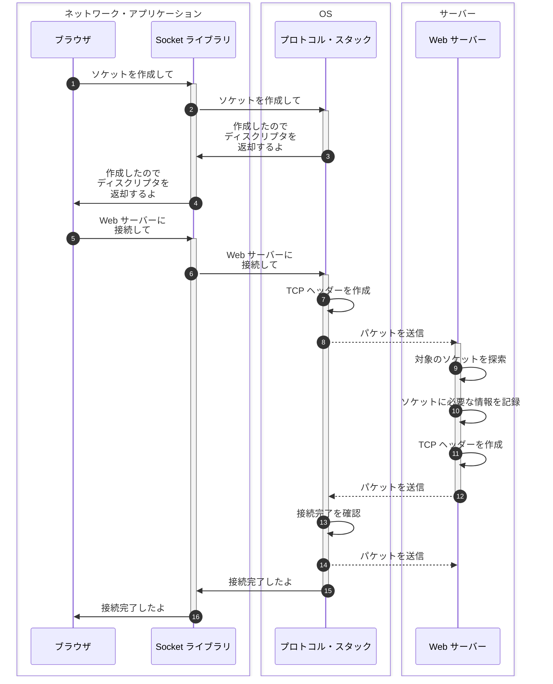

## はじめに

本シリーズの執筆意図などは前々回の記事に書いてあります。

- [前回のブラウザ編 > ネットワーク知識の重要性](https://zenn.dev/jnkmtsd/articles/0d129a7aa0947b#%E3%83%8D%E3%83%83%E3%83%88%E3%83%AF%E3%83%BC%E3%82%AF%E7%9F%A5%E8%AD%98%E3%81%AE%E9%87%8D%E8%A6%81%E6%80%A7)
- [前回のブラウザ編 > ネットワーク知識を記憶することの困難性](https://zenn.dev/jnkmtsd/articles/0d129a7aa0947b#%E3%83%8D%E3%83%83%E3%83%88%E3%83%AF%E3%83%BC%E3%82%AF%E7%9F%A5%E8%AD%98%E3%82%92%E8%A8%98%E6%86%B6%E3%81%99%E3%82%8B%E3%81%93%E3%81%A8%E3%81%AE%E5%9B%B0%E9%9B%A3%E6%80%A7)
- [前回のブラウザ編 > 困難性とどう向き合うか](https://zenn.dev/jnkmtsd/articles/0d129a7aa0947b#%E5%9B%B0%E9%9B%A3%E6%80%A7%E3%81%A8%E3%81%A9%E3%81%86%E5%90%91%E3%81%8D%E5%90%88%E3%81%86%E3%81%8B)

### 本シリーズの記事一覧

- [バックエンドエンジニアのためのネットワーク基礎【ブラウザ編】](https://zenn.dev/jnkmtsd/articles/0d129a7aa0947b)
- [バックエンドエンジニアのためのネットワーク基礎【DNS サーバー編】](https://zenn.dev/jnkmtsd/articles/e59e42beec39e0)
- バックエンドエンジニアのためのネットワーク基礎【プロトコル・スタック TCP 接続編】　 ← 本記事
- [バックエンドエンジニアのためのネットワーク基礎【プロトコル・スタック TCP 送受信編】](https://zenn.dev/jnkmtsd/articles/37a25508b30635)
- [バックエンドエンジニアのためのネットワーク基礎【プロトコル・スタック IP 編】](https://zenn.dev/jnkmtsd/articles/61f104becc1750)
- [バックエンドエンジニアのためのネットワーク基礎【イーサネット編】](https://zenn.dev/jnkmtsd/articles/c50f9113995773)
- [バックエンドエンジニアのためのネットワーク基礎【プロトコル・スタック UDP 編】](https://zenn.dev/jnkmtsd/articles/46615811cadd72)

### 本記事で書かないこと

- OS 以外の動作
  - 例）LAN アダプタ、ネットワーク・アプリケーション　など
- プロトコルなどの詳しい仕様

## 全体像

[前々回のブラウザ編 > 全体像](https://zenn.dev/jnkmtsd/articles/0d129a7aa0947b#%E5%85%A8%E4%BD%93%E5%83%8F)の中の、以下赤枠で示した箇所を細分化していきます。

それが以下です。

プロトコル・スタックとは、**OS に組み込まれたネットワーク制御用ソフトウェア**のことです。

また、プロトコル・スタックの内部は以下のように役割ごとに分かれています。

- TCP[^1]: コネクションを使う
- UDP[^2]: コネクションを使わない
- IP[^3]: パケットを運ぶ、経路を決める
  - ICMP[^4]
  - ARP[^5]

[^1]: [Transmission Control Protocol - Wikipedia](https://ja.wikipedia.org/wiki/Transmission_Control_Protocol)
[^2]: [User Datagram Protocol - Wikipedia](https://ja.wikipedia.org/wiki/User_Datagram_Protocol)
[^3]: [Internet Protocol - Wikipedia](https://ja.wikipedia.org/wiki/Internet_Protocol)
[^4]: [Internet Control Message Protocol - Wikipedia](https://ja.wikipedia.org/wiki/Internet_Control_Message_Protocol)
[^5]: [Address Resolution Protocol - Wikipedia](https://ja.wikipedia.org/wiki/Address_Resolution_Protocol)

Seq.8 Seq.12 は点線で示していますが、ここには様々な処理が隠蔽されています。
たとえば、LAN アダプタがどうのこうのとかそういうのが大量に含まれています。
このあたりのことは別記事で解説します。

## Seq.1〜4 ソケットを作成する

ソケットとは、以下のような**制御情報[^6]** のことです。

- 通信相手の IP アドレス、ポート番号
- 通信動作の進行状況　などなど

[^6]: 制御情報とは、プロトコル・スタック内でだけ使うソケットに記録される情報以外にも、クライアントとサーバーが互いに連絡を取り合うためにやり取りするヘッダーの意味もある

ソケットを作るとは、**ソケット 1 つ分のメモリー領域を確保して、そこに初期状態であることを記録**することです。

アプリケーション側には制御情報をそのまま渡すのではなく、ディスクリプタ[^7]を渡します。

[^7]: ディスクリプタについては、[バックエンドエンジニアのためのネットワーク基礎【ブラウザ編】 > 脚注 1](https://zenn.dev/jnkmtsd/articles/0d129a7aa0947b#fn-021d-5)参照

## Seq.5〜16 サーバーに接続する

接続するというのは、具体的には以下のようなことを指します。

- サーバーの IP アドレスやポート番号をプロトコル・スタックに知らせる
- サーバー側に通信動作の開始を伝える
  - クライアントの IP アドレスやポート番号　など
- バッファ・メモリー[^8]を確保する

[^8]: バッファ・メモリーとは、送受信するデータを一時的に格納するメモリー領域のこと

### Seq.7 [OS 側] TCP ヘッダーを作成する

色々な項目を設定しますが、ポイントは以下です。

- 送信元と宛先のポート番号
- コントロール・ビットの SYN[^9] ビットを 1 にする
- シーケンス番号[^10]の初期値（1 とは限らない）
- ウィンドウ[^11]の値

[^9]: SYN とは、接続確立の際にクライアントとサーバーが送り合うコントロール・ビットのこと
[^10]: シーケンス番号とは、各セグメントの先頭のバイトが何番目なのかがわかる番号のこと
[^11]: ウィンドウとは、受信可能なデータ量のこと

### Seq.8 [OS 側] パケットを送信する

IP 担当部分がパケット送信動作を実行します。

### Seq.9〜10 [Web サーバー側] 対象のソケットを探索して情報を記録する

TCP 担当部分が、TCP ヘッダーに記載されている宛先ポート番号に該当するソケットを探し出します。

探し出せたら、接続動作が進行中だという状態にします。

### Seq.11〜12 [Web サーバー側] TCP ヘッダーを作成してパケットを送信する

Seq.7 Seq.8 と同様です。

違いの一つとしては、ヘッダー作成の際 ACK[^12] というデータを 1 にすることです。
これは、パケットを受け取ったことを知らせるものです。

[^12]: ACK とは、パケットを受け取ったことを知らせるもの

### Seq.13 [OS 側] 接続完了を確認する

TCP ヘッダーを調べてサーバー側の接続動作が成功していることを確認します。
SYN が 1 なら接続成功です。

ソケットにサーバーの IP アドレスやポート番号、接続完了を示す制御情報を記録します。

### Seq.14 [OS 側] パケットを送信する

パケットが届いたことをサーバーに知らせるために ACK ビットを 1 にした TCP ヘッダーを送り返します。

## まとめ

プロトコル・スタックは以下のような流れで Web サーバーに接続します。

1. プロトコル・スタックはソケットを作成する
2. プロトコル・スタックは TCP ヘッダーを作成してパケットを送信する
3. Web サーバーはソケットを特定して制御情報を記録する
4. Web サーバーは TCP ヘッダーを作成してパケットを送信する
5. プロトコル・スタックは接続が完了したことを確認する
6. プロトコル・スタックはパケットが届いたことを Web サーバーに知らせるためにパケットを送る

## 参考

- [ネットワークはなぜつながるのか　第２版](https://www.amazon.co.jp/dp/B077XSB8BS)
