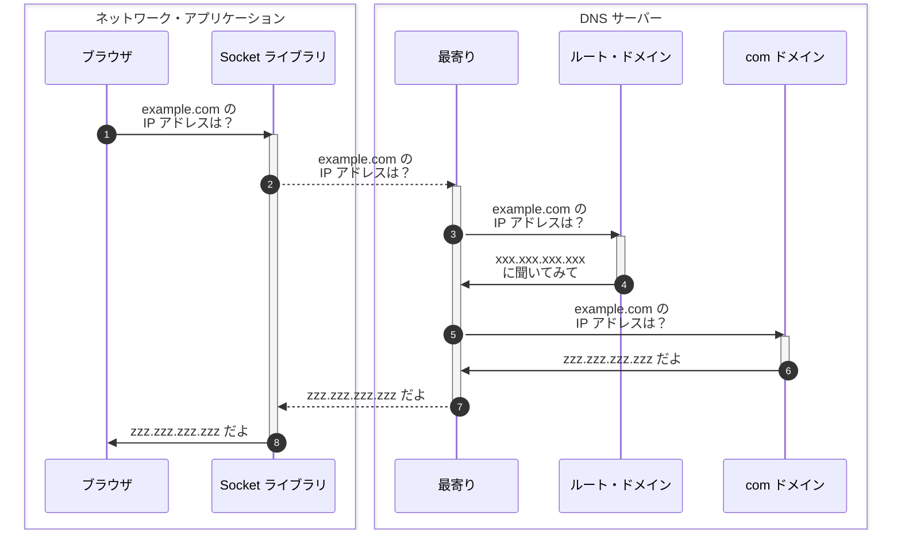

## はじめに

本シリーズの執筆意図などは前回の記事に書いてあります。

- [前回のブラウザ編 > ネットワーク知識の重要性](https://zenn.dev/jnkmtsd/articles/0d129a7aa0947b#%E3%83%8D%E3%83%83%E3%83%88%E3%83%AF%E3%83%BC%E3%82%AF%E7%9F%A5%E8%AD%98%E3%81%AE%E9%87%8D%E8%A6%81%E6%80%A7)
- [前回のブラウザ編 > ネットワーク知識を記憶することの困難性](https://zenn.dev/jnkmtsd/articles/0d129a7aa0947b#%E3%83%8D%E3%83%83%E3%83%88%E3%83%AF%E3%83%BC%E3%82%AF%E7%9F%A5%E8%AD%98%E3%82%92%E8%A8%98%E6%86%B6%E3%81%99%E3%82%8B%E3%81%93%E3%81%A8%E3%81%AE%E5%9B%B0%E9%9B%A3%E6%80%A7)
- [前回のブラウザ編 > 困難性とどう向き合うか](https://zenn.dev/jnkmtsd/articles/0d129a7aa0947b#%E5%9B%B0%E9%9B%A3%E6%80%A7%E3%81%A8%E3%81%A9%E3%81%86%E5%90%91%E3%81%8D%E5%90%88%E3%81%86%E3%81%8B)

### 本シリーズの記事一覧

- [バックエンドエンジニアのためのネットワーク基礎【ブラウザ編】](https://zenn.dev/jnkmtsd/articles/0d129a7aa0947b)
- バックエンドエンジニアのためのネットワーク基礎【DNS サーバー編】　 ← 本記事

### 本記事で書かないこと

- ネットワーク・アプリケーションと DNS サーバー以外の動作
  - 例）OS の動作、LAN アダプタ　など
- プロトコルなどの詳しい仕様

## 全体像

[前回のブラウザ編 > 全体像](https://zenn.dev/jnkmtsd/articles/0d129a7aa0947b#%E5%85%A8%E4%BD%93%E5%83%8F)の中の、以下赤枠で示した箇所を細分化していきます。

それが以下です。

Seq.2 Seq.9 は点線で示していますが、ここには様々な処理が隠蔽されています。
たとえば、OS での処理や LAN アダプタがどうのこうのとかそういうのが大量に含まれています。
このあたりのことは別記事で解説します。

## Seq.1 ブラウザからリゾルバ呼び出し

[前回のブラウザ編 > Seq.4〜5 Web サーバーの IP アドレスを取得](https://zenn.dev/jnkmtsd/articles/0d129a7aa0947b#seq.4%E3%80%9C5-web-%E3%82%B5%E3%83%BC%E3%83%90%E3%83%BC%E3%81%AE-ip-%E3%82%A2%E3%83%89%E3%83%AC%E3%82%B9%E3%82%92%E5%8F%96%E5%BE%97)でも触れた部分です。
そちらで言及していない部分を補足します。

リゾルバというのは、Socket ライブラリに含まれる、**DNS[^1] サーバーに問い合わせるためのプログラム**（`gethostbyname()`）です。

[^1]: [Domain Name System - Wikipedia](https://ja.wikipedia.org/wiki/Domain_Name_System)

## Seq.2 最寄りの DNS サーバーに問い合わせ

最寄りの DNS サーバーに example.com の IP アドレスを問い合わせます。
最寄りの DNS サーバーとは、**クライアントの TCP/IP 設定で指定した DNS サーバーのこと**です。

事前に設定してあるので、クライアントは何か特殊なことをせずに最寄りの DNS サーバーにアクセスできます。

## Seq.3〜4 ルート・ドメインの DNS サーバーに問い合わせ

最寄りの DNS サーバーに example.com の IP アドレスが登録されていないため、最寄りの DNS サーバーは、ルート・ドメインの DNS サーバーに example.com の IP アドレスを問い合わせます。

**ルート・ドメインの DNS サーバーの IP アドレスはすべての DNS サーバーに事前に登録されている**ため、最寄りの DNS サーバーは何か特殊なことをせずにルート・ドメインの DNS サーバーにアクセスできます。

ルート・ドメインの DNS サーバーにも example.com の IP アドレスは登録されていませんが、com ドメインの DNS サーバーの IP アドレスは登録されています。
そこで、com ドメインの DNS サーバーの IP アドレス（xxx.xxx.xxx.xxx）を返却します。

## Seq.5〜6 com ドメインの DNS サーバーに問い合わせ

最寄りの DNS サーバーは、com ドメインの DNS サーバーに example.com の IP アドレスを問い合わせます。

**com ドメインの DNS サーバーには example.com の IP アドレスが登録されている**ので、com ドメインの DNS サーバーは example.com の IP アドレス（zzz.zzz.zzz.zzz）を返却します。

## Seq.7〜8 ブラウザに対象の IP アドレスを返却

最寄りの DNS サーバーは、ブラウザに example.com の IP アドレス（zzz.zzz.zzz.zzz）を返却します。

## まとめ

DNS サーバーは以下のよう流れで対象の Web サーバーの IP アドレスを返却します。

1. 最寄りの DNS サーバーに問い合わせる
2. 最寄りの DNS サーバーはルート・ドメインの DNS サーバーに問い合わせる
3. 最寄りの DNS サーバーはトップレベルドメインの DNS サーバーに問い合わせる
4. 対象のドメインの IP アドレスがわかるまで下層の DNS サーバーに問い合わせる
5. 対象のドメインの IP アドレスがわかったらネットワーク・アプリケーションに返却する

## 参考

- [ネットワークはなぜつながるのか　第２版](https://www.amazon.co.jp/dp/B077XSB8BS)
